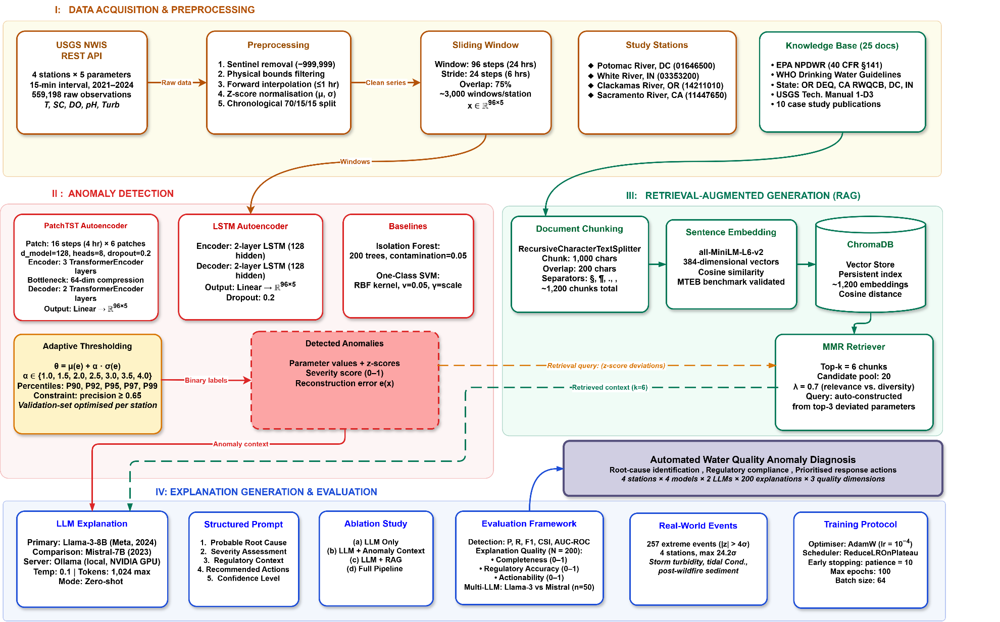

# WQ-RAG: AI-enabled root-cause diagnosis of water quality anomalies in continuous monitoring networks using a retrieval-augmented generation (RAG) approach

Reference implementation for

> **Alam, G., Ihsanullah, I. (2026).** *AI-Enabled Root-Cause Diagnosis of Water Quality Anomalies
> in Continuous Monitoring Networks Using a Retrieval-Augmented Generation (RAG) Approach.*
> **Journal of Environmental Management** (accepted; manuscript JEMA-D-26-16999R1).

WQ-RAG couples **unsupervised reconstruction-based anomaly detection** (PatchTST-AE, LSTM-AE,
with Isolation Forest / One-Class SVM baselines) on 15-minute USGS sensor streams with a
**retrieval-augmented LLM** (Llama-3-8B, Mistral-7B via Ollama) grounded in a 25-document
regulatory knowledge base, to turn raw alerts into regulation-aware root-cause diagnoses.

<p align="center"></p>

---

## 1. What is in this repository

| Path | Purpose | Paper section |
|------|---------|---------------|
| `wqrag/config.py` | every hyper-parameter, station, path | §2, Fig. 2, Tables 1-2 |
| `wqrag/data_download.py` | USGS NWIS REST-API downloader (2021-2024, 5 parameters, 4 stations) | §2.1 |
| `wqrag/preprocessing.py` | sentinel removal, physical bounds, ≤1 h gap fill, chronological 70/15/15 split, train-stat z-scores, 96×5 windows (stride 24), ±3σ labels | §2.2.1 |
| `wqrag/models.py` | PatchTST autoencoder, LSTM autoencoder | §2.2.2 |
| `wqrag/thresholding.py` | adaptive per-station θ (α ∈ {1.0…4.0}, P90-P99, precision ≥ 0.65) | §2.2.2 |
| `wqrag/detection.py` | AdamW training loop, IF/OC-SVM, P/R/F1/CSI/AUC, confusion matrices | §2.2.2, §2.4.2, Table 3 |
| `wqrag/knowledge_base.py` | 4-category KB → 1 000/200 chunks → MiniLM-L6-v2 → ChromaDB → MMR (k 6, pool 20, λ 0.7) | §2.2.3 |
| `wqrag/explainer.py` | anomaly context, retrieval query, 5-section prompt, Ollama chains, ablation, multi-LLM | §2.2.4 |
| `wqrag/evaluation.py` | completeness / regulatory accuracy / actionability, Cohen's d, \|z\|>4σ events, Tables 4-7 | §2.4.2, §3.4-3.8 |
| `wqrag/figures.py` | Figs 1, 3-10 (publication style, PNG + PDF) | §3 |
| `scripts/01…10_*.py` | numbered CLI for each stage; `run_pipeline.py` runs them all | — |
| `paper_results/` | Tables 1, 3-7 exactly as published — regenerate Figs 3, 7, 8a, 9, 10 without re-running; diff fresh runs | — |
| `knowledge_base/` | manifest of the 25 documents + included station-metadata & thresholds files | §2.2.3 |
| `docs/PAPER_ALIGNMENT.md` | line-by-line map from every number/figure/table in the paper to the code | — |
| `tests/` | 14 unit/smoke tests (incl. a CPU training run of both autoencoders) | — |

## 2. Quick start

```bash
git clone https://github.com/gulzara3/Water_RAG && cd Water_RAG
python -m venv .venv && source .venv/bin/activate          # Windows: .venv\Scripts\activate
pip install -r requirements.txt                            # torch picks CUDA automatically if available
pip install -e .                                           # optional: makes `import wqrag` work anywhere

# Reproduce the published figures from the published tables (no data / GPU / LLM needed)
python scripts/09_make_figures_tables.py --from-paper --out results/figures_from_paper

# Full experiment
ollama serve &  ollama pull llama3:8b  &&  ollama pull mistral:7b
python run_pipeline.py                  # download → preprocess → train → KB → explain → ablation → compare → evaluate → figures
python run_pipeline.py --detection-only # Stages I-II + Figs 3-6, 9-10 only (no LLM)
```

Typical run time on one 16 GB GPU (as in the paper): preprocessing ≈ 1 min, 16 detector trainings
≈ 20-40 min, KB indexing ≈ 3 min, 200 + 50 + 20 LLM generations ≈ 45-90 min.

### Stage-by-stage

| # | Command | Produces |
|---|---------|----------|
| 1 | `python scripts/01_download_data.py` | `data/raw/station_<id>.csv` |
| 2 | `python scripts/02_preprocess.py` | `data/processed/*.npz`, `results/tables/table1_stations.csv` |
| 3 | `python scripts/03_train_detectors.py` | `results/detection_<id>.json`, `results/scores_<id>.npz`, `results/models/*.pt`, **Table 3** |
| 4 | `python scripts/04_build_knowledge_base.py` | `chroma_db/` (≈1 200 chunks) |
| 5 | `python scripts/05_generate_explanations.py` | `results/explanations/explanations_<id>.json` (50 × 4) |
| 6 | `python scripts/06_run_ablation.py` | `results/explanations/ablation_14211010.json` (4 configs × 5) |
| 7 | `python scripts/07_run_llm_comparison.py` | `results/explanations/llm_comparison_14211010.json` (2 LLMs × 50) |
| 8 | `python scripts/08_evaluate.py` | **Tables 4, 5, 6, 7** in `results/tables/` |
| 9 | `python scripts/09_make_figures_tables.py` | **Figs 1, 3-10** in `results/figures/` |
| 10 | `python scripts/10_compare_with_paper.py` | diff of a fresh run vs. `paper_results/` |

Every script accepts `--help`; e.g. `03_train_detectors.py --station 14211010 --epochs 5` for a smoke test.
Set `WQRAG_ROOT=/some/big/disk` to keep data/results outside the repo; `OLLAMA_BASE_URL` to point at a remote Ollama.

## 3. Data

Four USGS continuous monitoring stations, 15-min interval, 2021-01-01 → 2024-12-31 (Table 1):

| USGS ID | Station | Region | SC range (µS/cm) |
|---------|---------|--------|------------------|
| 01646500 | Potomac River, DC | East Coast | 200-600 |
| 03351000 | White River, IN | Midwest | 400-1 200 |
| 14211010 | Clackamas River, OR | Pacific NW | 30-65 |
| 11447650 | Sacramento River, CA | West Coast | 100-300 |

Parameters (Table 2): temperature 00010 (°C), specific conductance 00095 (µS/cm), dissolved oxygen
00300 (mg/L), pH 00400, turbidity 63680 (FNU).  Data are public: USGS NWIS, DOI 10.5066/F7P55KJN.

## 4. Knowledge base (25 documents, 4 categories)

Regulatory standards (EPA NPDWR, EPA Secondary, WHO GDWQ 4th ed.) · Technical guides (USGS TM 1-D3,
parameter codes, EPA 2018 standards & health advisories, EPA monitoring guidance, consolidated
thresholds reference) · 10 peer-reviewed case studies · Station metadata (4 stations + jurisdiction
cross-walk).  See `knowledge_base/MANIFEST.md` for every file and where to obtain it; copyrighted PDFs
are not redistributed.  Station-metadata and the thresholds reference are included.

## 5. Key published results (reproduced by `paper_results/`)

* Detection (Table 3): LSTM-AE best F1 at 3/4 stations (0.799-0.841); PatchTST AUC-ROC 0.860-0.906,
  perfect recall; adaptive thresholding +61 % F1 at Clackamas.
* Explanations (Table 4, N = 200): overall 0.853 ± 0.020; regulatory accuracy 0.684-0.848.
* Ablation (Table 5, n = 5): regulatory accuracy 0.20 → 0.76 (3.8×) with retrieval.
* Multi-LLM (Table 6, n = 50): Llama-3-8B 0.822 vs Mistral-7B 0.741 overall, Cohen's d = 0.958.
* Extreme events (Table 7): 257 events with |z| > 4σ, max 24.2σ (Sacramento turbidity).

## 6. Reusing WQ-RAG on your own network

1. Add your station to `STATIONS` in `wqrag/config.py` (USGS ID → NWIS download works unchanged; for
   other providers write a CSV with the five columns into `data/raw/`).
2. Drop your jurisdiction's regulations into `knowledge_base/` and a `station_<id>.txt` metadata file;
   rebuild with `scripts/04_build_knowledge_base.py --rebuild`.
3. Run stages 2-9.  No model redesign is required — only the knowledge base changes (§3.8.2 of the paper).

## 7. Tests

```bash
pytest -q            # 14 tests, ~90 s on CPU (includes 2-epoch PatchTST/LSTM-AE training)
pytest -q -m "not slow"
```

## 8. Citation

See `CITATION.cff`.  Please cite the Journal of Environmental Management article when using this code.

## 9. Licence

MIT (see `LICENSE`).  USGS data are public domain; knowledge-base PDFs retain their own licences.
